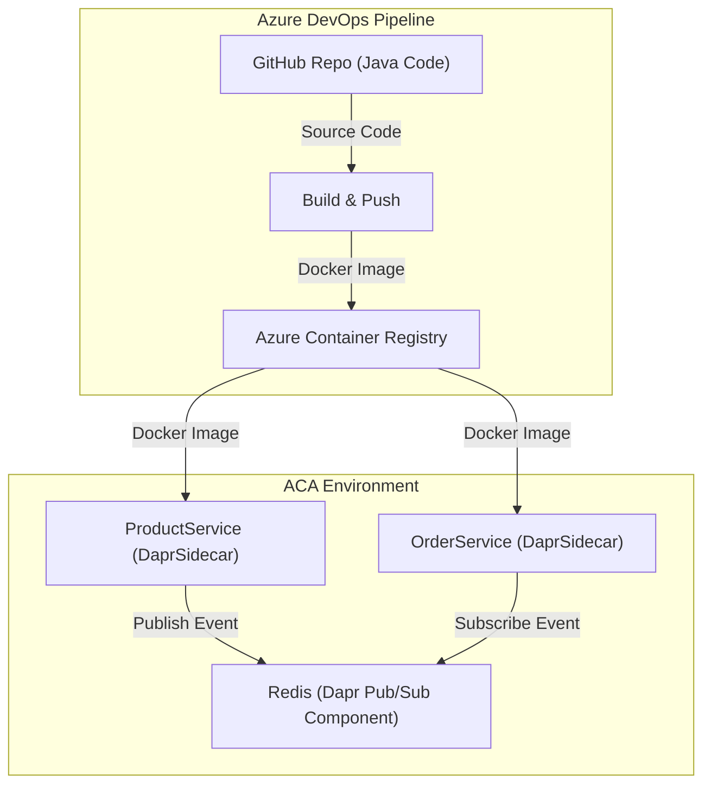

# ProductsAndOrders Microservices on Azure Container Apps with Dapr

## Introduction
This project consists of two microservices:
- **ProductService**: Manages product catalog, including product details and availability.
- **OrderService**: Handles customer orders, including order creation and status tracking.

These services communicate using Dapr's pub/sub model with Redis as the message broker, deployed as a separate Azure Container App.

## Architecture Diagram



## Docker Image Creation and Push to ACR
Docker images are built and pushed to Azure Container Registry (ACR).

ACR: `stackrouteprdsandorders.azurecr.io`

Images:
- `stackrouteprdsandorders.azurecr.io/productservice:latest`
- `stackrouteprdsandorders.azurecr.io/orderservice:latest`

## ACA Environment and Microservice Deployment
```bash
RESOURCE_GROUP="productsandorders"
LOCATION="East US 2"
ENVIRONMENT="aca-dapr-env"

az group create --name $RESOURCE_GROUP --location $LOCATION
az containerapp env create --name $ENVIRONMENT --resource-group $RESOURCE_GROUP --location $LOCATION
```

### Deploy Services
```bash
az containerapp create --name productservice --resource-group $RESOURCE_GROUP --environment $ENVIRONMENT   --image $ACR/productservice:latest --target-port 8080 --ingress external   --registry-server $ACR --enable-dapr --dapr-app-id productservice --dapr-app-port 8080

az containerapp create --name orderservice --resource-group $RESOURCE_GROUP --environment $ENVIRONMENT   --image $ACR/orderservice:latest --target-port 8081 --ingress internal   --registry-server $ACR --enable-dapr --dapr-app-id orderservice --dapr-app-port 8081
```

### Set Registry Credentials
```bash
az containerapp registry set --name productservice --resource-group $RESOURCE_GROUP   --server $ACR_SERVER --username $ACR_USER --password "$ACR_PASS"

az containerapp registry set --name orderservice --resource-group $RESOURCE_GROUP   --server $ACR_SERVER --username $ACR_USER --password "$ACR_PASS"
```

### Update Container Images
```bash
az containerapp update --name productservice --resource-group $RESOURCE_GROUP   --image $ACR_SERVER/productservice:latest

az containerapp update --name orderservice --resource-group $RESOURCE_GROUP   --image $ACR_SERVER/orderservice:latest
```

## Redis Setup for Dapr Pub/Sub
```bash
az containerapp create --name redis --resource-group $RESOURCE_GROUP --environment $ENVIRONMENT   --image redis:6.2 --target-port 6379 --ingress internal
```

### Get Redis FQDN
```bash
az containerapp show --name redis --resource-group $RESOURCE_GROUP   --query properties.configuration.ingress.fqdn -o tsv
```

## Dapr Component Configuration
### pubsub.yaml
```yaml
apiVersion: dapr.io/v1alpha1
kind: Component
metadata:
  name: redis-pubsub
  namespace: default
spec:
  type: pubsub.redis
  version: v1
  metadata:
  - name: redisHost
    value: "<redis-fqdn>:6379"
scopes:
  - productservice
  - orderservice
```

## Testing Pub/Sub Interaction
### Publish Event via curl
```bash
curl -X POST https://<productservice-fqdn>/products   -H "Content-Type: application/json"   -d '{ "id": 1, "name": "Test Product", "price": 99.99 }'
```

### Monitor Logs
```bash
az containerapp logs show --name productservice --resource-group productsandorders
az containerapp logs show --name orderservice --resource-group productsandorders
```

## Deliverables
- Source Code Folder (Github)
- Dockerfiles (Github)
- Container Image Details (Github & Screenshots in PDF file)
- Dapr Components Configuration (Github)
- Azure Deployment Config (Screenshots in PDF file)
- Architecture Diagram (Github README.md mermaid)
- Screenshots and Logs (in PDF File)
- README.md (Github)
